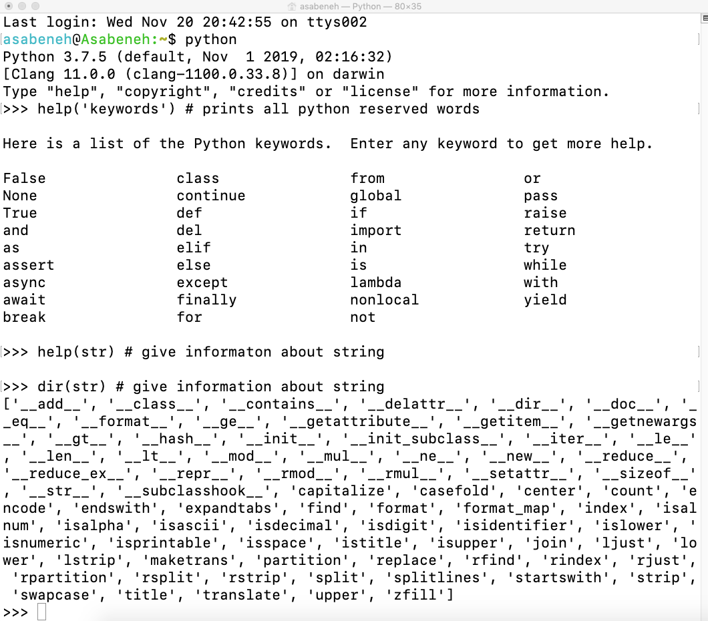

# 📘 День 2

## 2. Переменные. Встроенные функции

В Python есть множество встроенных функций. Встроенные функции глобально доступны для вашего использования, что означает, что вы можете использовать встроенные функции без импорта или настройки. Некоторые из наиболее часто используемых встроенных функций Python следующие: _print()_, _len()_, _type()_, _int()_, _float()_, _str()_, _input()_, _list()_, _dict()_, _min()_, _max()_, _sum()_, _sorted()_, _open()_, _file()_, _help()_ и _dir()_. В следующей таблице вы увидите исчерпывающий список встроенных функций Python, взятый из [документации python](https://docs.python.org/3.9/library/functions.html).


Давайте откроем оболочку Python и начнем использовать некоторые из наиболее распространенных встроенных функций.


Давайте потренируемся, используя различные встроенные функции



Как видно из терминала выше, в Python есть зарезервированные слова. Мы не используем зарезервированные слова для объявления переменных или функций. Мы рассмотрим переменные в следующем разделе.

Думаю, к настоящему моменту вы уже знакомы со встроенными функциями. Давайте сделаем еще одну тренировку встроенных функций и перейдем к следующему разделу.


## Переменные

Переменные хранят данные в памяти компьютера. Мнемонические переменные рекомендуется использовать во многих языках программирования. Мнемоническая переменная - это имя переменной, которое легко запоминается и ассоциируется. Переменная относится к адресу памяти, в котором хранятся данные.
Число в начале, специальный символ, дефис не допускаются при именовании переменной. Переменная может иметь короткое имя (например, x, y, z), но настоятельно рекомендуется использовать более описательное имя (имя, фамилия, возраст, страна).

Правила именования переменных в Python

- Имя переменной должно начинаться с буквы или символа подчеркивания
- Имя переменной не может начинаться с цифры
- Имя переменной может содержать только буквенно-цифровые символы и символы подчеркивания (A-z, 0-9 и \_ ).
- Имена переменных чувствительны к регистру (firstname, Firstname, FirstName и FIRSTNAME) - это разные переменные)

Приведем имена допустимых переменных

```shell
firstname
lastname
age
country
city
first_name
last_name
capital_city
_if # if we want to use reserved word as a variable
year_2021
year2021
current_year_2021
birth_year
num1
num2
```

Недопустимые имена переменных

```shell
first-name
first@name
first$name
num-1
1num
```

Мы будем использовать стандартный стиль именования переменных Python, который был принят многими разработчиками Python. Разработчики Python используют соглашение об именовании переменных в змеином регистре (snake_case). Мы используем символ подчеркивания после каждого слова для переменной, содержащей более одного слова (например, first_name, last_name, engine_rotation_speed).  Пример ниже - это пример стандартного именования переменных, подчеркивание требуется, когда имя переменной состоит более чем из одного слова.

Когда мы присваиваем переменной определенный тип данных, это называется объявлением переменной. Например, в приведенном ниже примере мое имя присваивается переменной first_name. Знак равенства - это оператор присваивания. Присвоение означает сохранение данных в переменной. Знак равенства в Python не является равенством, как в математике.

_Пример:_

```py
# Переменные в Python
first_name = 'Asabeneh'
last_name = 'Yetayeh'
country = 'Finland'
city = 'Helsinki'
age = 250
is_married = True
skills = ['HTML', 'CSS', 'JS', 'React', 'Python']
person_info = {
   'firstname':'Asabeneh',
   'lastname':'Yetayeh',
   'country':'Finland',
   'city':'Helsinki'
   }
```

Давайте воспользуемся встроенными функциями _print()_ и _len()_. Функция print принимает неограниченное количество аргументов. Аргумент - это значение, которое можно передать или поместить внутрь скобки функции, см. пример ниже.

**Пример:**

```py
print('Hello, World!') # Текст Hello, World! является аргументом
print('Hello',',', 'World','!') # он может принимать несколько аргументов, было передано четыре аргумента
print(len('Hello, World!')) # принимает только один аргумент
```

Выведем на печать, а также найдем длину переменных, объявленных вверху:

**Пример:**

```py
# Вывод значений, хранящихся в переменных

print('First name:', first_name)
print('First name length:', len(first_name))
print('Last name: ', last_name)
print('Last name length: ', len(last_name))
print('Country: ', country)
print('City: ', city)
print('Age: ', age)
print('Married: ', is_married)
print('Skills: ', skills)
print('Person information: ', person_info)
```

### Объявление нескольких переменных в одной строке

Несколько переменных также могут быть объявлены в одной строке:

**Пример:**

```py
first_name, last_name, country, age, is_married = 'Asabeneh', 'Yetayeh', 'Helsink', 250, True


print(first_name, last_name, country, age, is_married)
print('First name:', first_name)
print('Last name: ', last_name)
print('Country: ', country)
print('Age: ', age)
print('Married: ', is_married)
```

Получение пользовательского ввода с помощью встроенной функции _input()_. Давайте присвоим данные, полученные от пользователя, переменным first_name и age.
**Пример:**

```py
first_name = input('Как вас зовут: ')
age = input('Сколько вам лет? ')

print(first_name)
print(age)
```

## Типы данных

В Python существует несколько типов данных. Для определения типа данных мы используем встроенную функцию _type_. Я хотел бы попросить вас сосредоточиться на понимании различных типов данных. Когда речь идет о программировании, все дело в типах данных. Я ввел типы данных в самом начале, и я снова ввожу их, потому что каждая тема связана с типами данных. Мы рассмотрим типы данных более подробно в соответствующих разделах.

## Проверка типов данных и приведения

- Проверка типов данных: Чтобы проверить тип данных определенных данных/переменной, мы используем _тип_.
  **Пример:**

```py
# Различные типы данных python
# Давайте объявим переменные с различными типами данных

first_name = 'Asabeneh' # str
last_name = 'Yetayeh' # str
страна = 'Финляндия' # str
город= 'Хельсинки' # str
возраст = 250 # int, это не мой реальный возраст, не беспокойтесь об этом

# Вывод типов
print(type('Asabeneh'))     # str
print(type(first_name))     # str
print(type(10))             # int
print(type(3.14))           # float
print(type(1 + 1j))         # complex
print(type(True))           # bool
print(type([1, 2, 3, 4]))     # list
print(type({'name':'Asabeneh','age':250, 'is_married':250}))    # dict
print(type((1,2)))                                              # tuple
print(type(zip([1,2],[3,4])))                                   # set
```

- Кастинг: Преобразование одного типа данных в другой тип данных. Мы используем _int()_, _float()_, _str()_, _list_, _set_.
  При выполнении арифметических операций строковые числа должны быть сначала преобразованы в int или float, иначе будет выдана ошибка. Если мы конкатенируем число со строкой, число должно быть сначала преобразовано в строку. О конкатенации мы поговорим в разделе String.

  **Пример:**

```py
# int в float
num_int = 10
print('num_int',num_int) # 10
num_float = float(num_int)
print('num_float:', num_float) # 10.0

# float to int
гравитация = 9,81
print(int(gravity)) # 9

# int в str
num_int = 10
print(num_int) # 10
num_str = str(num_int)
print(num_str) # '10'

# преобразование строки в int или float
num_str = '10.6'
print('num_int', int(num_str))      # 10
print('num_float', float(num_str))  # 10.6

# строка в список
first_name = 'Asabeneh'
print(first_name) # 'Asabeneh'
first_name_to_list = list(first_name)
print(first_name_to_list) # ['A', 's', 'a', 'b', 'e', 'n', 'e', 'h']
```

## Числа

Числовые типы данных в Python:

1. Целые числа: Целые (отрицательные, нулевые и положительные) числа
   Пример:
   ... -3, -2, -1, 0, 1, 2, 3 ...

2. Числа с плавающей запятой (десятичные числа)
   Пример:
   ... -3.5, -2.25, -1.0, 0.0, 1.1, 2.2, 3.5 ...

3. Комплексные числа
   Пример:
   1 + j, 2 + 4j, 1 - 1j

🌕 Вы великолепны. Вы только что завершили второй день испытаний, и вы на два шага впереди на пути к величию. Теперь сделайте несколько упражнений для мозга и мышц.

## 💻 Упражнения - день 2

### Упражнения: Уровень 1

1. Внутри 14DaysOfPython создайте папку под названием day_2. Внутри этой папки создайте файл с именем variables.py
2. Напишите python комментарий к статье 'День 2: 30 дней программирования на python'
3. Объявите переменную первого имени и присвойте ей значение
4. Объявите переменную "Фамилия" и присвойте ей значение
5. Объявите переменную с полным именем и присвойте ей значение
6. Объявите переменную country и присвойте ей значение
7. Объявите переменную city и присвойте ей значение
8. Объявите переменную возраст и присвойте ей значение
9. Объявите переменную year и присвойте ей значение
10. Объявите переменную is_married и присвойте ей значение
11. Объявите переменную is_true и присвойте ей значение
12. Объявите переменную is_light_on и присвойте ей значение
13. Объявление нескольких переменных в одной строке

