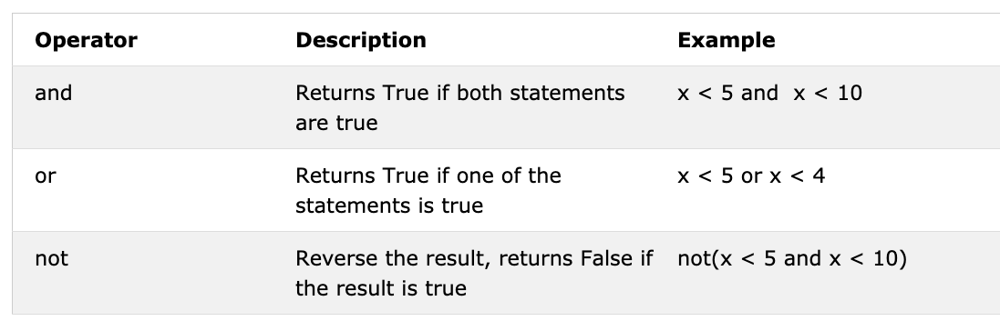

# 📘 Day 3

## Boolean

A boolean data type represents one of the two values: _True_ or _False_. The use of these data types will be clear once we start using the comparison operator. The first letter **T** for True and **F** for False should be capital unlike JavaScript.
**Example: Boolean Values**

```py
print(True)
print(False)
```

## Operators

Python language supports several types of operators. In this section, we will focus on few of them.

### Assignment Operators

Assignment operators are used to assign values to variables. Let us take = as an example. Equal sign in mathematics shows that two values are equal, however in Python it means we are storing a value in a certain variable and we call it assignment or a assigning value to a variable. The table below shows the different types of python assignment operators, taken from [w3school](https://www.w3schools.com/python/python_operators.asp).


### Arithmetic Operators:

- Addition(+): a + b
- Subtraction(-): a - b
- Multiplication(*): a * b
- Division(/): a / b
- Modulus(%): a % b
- Floor division(//): a // b
- Exponentiation(**): a ** b


**Example:Integers**

```py
# Arithmetic Operations in Python
# Integers

print('Addition: ', 1 + 2)        # 3
print('Subtraction: ', 2 - 1)     # 1
print('Multiplication: ', 2 * 3)  # 6
print ('Division: ', 4 / 2)       # 2.0  Division in Python gives floating number
print('Division: ', 6 / 2)        # 3.0         
print('Division: ', 7 / 2)        # 3.5
print('Division without the remainder: ', 7 // 2)   # 3,  gives without the floating number or without the remaining
print ('Division without the remainder: ',7 // 3)   # 2
print('Modulus: ', 3 % 2)         # 1, Gives the remainder
print('Exponentiation: ', 2 ** 3) # 9 it means 2 * 2 * 2
```

**Example:Floats**

```py
# Floating numbers
print('Floating Point Number, PI', 3.14)
print('Floating Point Number, gravity', 9.81)
```

**Example:Complex numbers**

```py
# Complex numbers
print('Complex number: ', 1 + 1j)
print('Multiplying complex numbers: ',(1 + 1j) * (1 - 1j))
```

Let's declare a variable and assign a number data type. I am going to use single character variable but remember do not develop a habit of declaring such types of variables. Variable names should be all the time mnemonic.

**Example:**

```python
# Declaring the variable at the top first

a = 3 # a is a variable name and 3 is an integer data type
b = 2 # b is a variable name and 3 is an integer data type

# Arithmetic operations and assigning the result to a variable
total = a + b
diff = a - b
product = a * b
division = a / b
remainder = a % b
floor_division = a // b
exponential = a ** b

# I should have used sum instead of total but sum is a built-in function - try to avoid overriding built-in functions
print(total) # if you do not label your print with some string, you never know where the result is coming from
print('a + b = ', total)
print('a - b = ', diff)
print('a * b = ', product)
print('a / b = ', division)
print('a % b = ', remainder)
print('a // b = ', floor_division)
print('a ** b = ', exponentiation)
```

**Example:**

```py
print('== Addition, Subtraction, Multiplication, Division, Modulus ==')

# Declaring values and organizing them together
num_one = 3
num_two = 4

# Arithmetic operations
total = num_one + num_two
diff = num_two - num_one
product = num_one * num_two
div = num_two / num_one
remainder = num_two % num_one

# Printing values with label
print('total: ', total)
print('difference: ', diff)
print('product: ', product)
print('division: ', div)
print('remainder: ', remainder)
```

Let us start start connecting the dots and start making use of what we already know to calculate (area, volume,density,  weight, perimeter, distance, force).

**Example:**

```py
# Calculating area of a circle
radius = 10                                 # radius of a circle
area_of_circle = 3.14 * radius ** 2         # two * sign means exponent or power
print('Area of a circle:', area_of_circle)

# Calculating area of a rectangle
length = 10
width = 20
area_of_rectangle = length * width
print('Area of rectangle:', area_of_rectangle)

# Calculating a weight of an object
mass = 75
gravity = 9.81
weight = mass * gravity
print(weight, 'N')                         # Adding unit to the weight

# Calculate the density of a liquid
mass = 75 # in Kg
volume = 0.075 # in cubic meter
density = mass / volume # 1000 Kg/m^3

```

### Comparison Operators

In programming we compare values, we use comparison operators to compare two values. We check if a value is greater or less or equal to other value. The following table shows Python comparison operators which was taken from [w3shool](https://www.w3schools.com/python/python_operators.asp).


**Example: Comparison Operators**

```py
print(3 > 2)     # True, because 3 is greater than 2
print(3 >= 2)    # True, because 3 is greater than 2
print(3 < 2)     # False,  because 3 is greater than 2
print(2 < 3)     # True, because 2 is less than 3
print(2 <= 3)    # True, because 2 is less than 3
print(3 == 2)    # False, because 3 is not equal to 2
print(3 != 2)    # True, because 3 is not equal to 2
print(len('mango') == len('avocado'))  # False
print(len('mango') != len('avocado'))  # True
print(len('mango') < len('avocado'))   # True
print(len('milk') != len('meat'))      # False
print(len('milk') == len('meat'))      # True
print(len('tomato') == len('potato'))  # True
print(len('python') > len('dragon'))   # False


# Comparing something gives either a True or False

print('True == True: ', True == True)
print('True == False: ', True == False)
print('False == False:', False == False)
```

In addition to the above comparison operator Python uses:

- _is_: Returns true if both variables are the same object(x is y)
- _is not_: Returns true if both variables are not the same object(x is not y)
- _in_: Returns True if the queried list contains a certain item(x in y)
- _not in_: Returns True if the queried list doesn't have a certain item(x in y)

```py
print('1 is 1', 1 is 1)                   # True - because the data values are the same
print('1 is not 2', 1 is not 2)           # True - because 1 is not 2
print('A in Asabeneh', 'A' in 'Asabeneh') # True - A found in the string
print('B in Asabeneh', 'B' in 'Asabeneh') # False - there is no uppercase B
print('coding' in 'coding for all') # True - because coding for all has the word coding
print('a in an:', 'a' in 'an')      # True
print('4 is 2 ** 2:', 4 is 2 ** 2)   # True
```

### Logical Operators

Unlike other programming languages python uses keywords _and_, _or_ and _not_ for logical operators. Logical operators are used to combine conditional statements:



```py
print(3 > 2 and 4 > 3) # True - because both statements are true
print(3 > 2 and 4 < 3) # False - because the second statement is false
print(3 < 2 and 4 < 3) # False - because both statements are false
print('True and True: ', True and True)
print(3 > 2 or 4 > 3)  # True - because both statements are true
print(3 > 2 or 4 < 3)  # True - because one of the statements is true
print(3 < 2 or 4 < 3)  # False - because both statements are false
print('True or False:', True or False)
print(not 3 > 2)     # False - because 3 > 2 is true, then not True gives False
print(not True)      # False - Negation, the not operator turns true to false
print(not False)     # True
print(not not True)  # True
print(not not False) # False

```

🌕 You have boundless energy. You have just completed day 3 challenges and you are three steps ahead on your way to greatness. Now do some exercises for your brain and your muscles.

## 💻 Exercises - Day 3

1. Declare your age as integer variable
2. Declare your height as a float variable
3. Declare a variable that store a complex number
4. Write a script that prompts the user to enter base and height of the triangle and calculate an area of this triangle (area = 0.5 x b x h).

```py
    Enter base: 20
    Enter height: 10
    The area of the triangle is 100
```

5. Write a script that prompts the user to enter side a, side b, and side c of the triangle. Calculate the perimeter of the triangle (perimeter = a + b + c).

```py
Enter side a: 5
Enter side b: 4
Enter side c: 3
The perimeter of the triangle is 12
```

6. Get length and width of a rectangle using prompt. Calculate its area (area = length x width) and perimeter (perimeter = 2 x (length + width))
7. Get radius of a circle using prompt. Calculate the area (area = pi x r x r) and circumference (c = 2 x pi x r) where pi = 3.14.
8. Calculate the slope, x-intercept and y-intercept of y = 2x -2
9. Slope is (m = y2-y1/x2-x1). Find the slope and [Euclidean distance](https://en.wikipedia.org/wiki/Euclidean_distance#:~:text=In%20mathematics%2C%20the%20Euclidean%20distance,being%20called%20the%20Pythagorean%20distance.) between point (2, 2) and point (6,10) 
10. Compare the slopes in tasks 8 and 9.
11. Calculate the value of y (y = x^2 + 6x + 9). Try to use different x values and figure out at what x value y is going to be 0.
12. Find the length of 'python' and 'dragon' and make a falsy comparison statement.
13. Use _and_ operator to check if 'on' is found in both 'python' and 'dragon'
14. _I hope this course is not full of jargon_. Use _in_ operator to check if _jargon_ is in the sentence.
15. There is no 'on' in both dragon and python
16. Find the length of the text _python_ and convert the value to float and convert it to string
17. Even numbers are divisible by 2 and the remainder is zero. How do you check if a number is even or not using python?
18. Check if the floor division of 7 by 3 is equal to the int converted value of 2.7.
19. Check if type of '10' is equal to type of 10
20. Check if int('9.8') is equal to 10
21. Writ a script that prompts the user to enter hours and rate per hour. Calculate pay of the person?

```py
Enter hours: 40
Enter rate per hour: 28
Your weekly earning is 1120
```

22. Write a script that prompts the user to enter number of years. Calculate the number of seconds a person can live. Assume a person can live hundred years

```py
Enter number of years you have lived: 100
You have lived for 3153600000 seconds.
```

23. Write a Python script that displays the following table

```py
1 1 1 1 1
2 1 2 4 8
3 1 3 9 27
4 1 4 16 64
5 1 5 25 125
```

# Day 4

## Strings

Text is a string data type. Any data type written as text is a string. Any data under single, double or triple quote are strings. There are different string methods and built-in functions to deal with string data types. To check the length of a string use the len() method.

### Creating a String

```py
letter = 'P'                # A string could be a single character or a bunch of texts
print(letter)               # P
print(len(letter))          # 1
greeting = 'Hello, World!'  # String could be made using a single or double quote,"Hello, World!"
print(greeting)             # Hello, World!
print(len(greeting))        # 13
sentence = "I hope you are enjoying 30 days of Python Challenge"
print(sentence)
```

Multiline string is created by using triple single (''') or triple double quotes ("""). See the example below.

```py
multiline_string = '''I am a teacher and enjoy teaching.
I didn't find anything as rewarding as empowering people.
That is why I created 30 days of python.'''
print(multiline_string)

# Another way of doing the same thing
multiline_string = """I am a teacher and enjoy teaching.
I didn't find anything as rewarding as empowering people.
That is why I created 30 days of python."""
print(multiline_string)
```

### String Concatenation

We can connect strings together. Merging or connecting strings is called concatenation. See the example below:

```py
first_name = 'Asabeneh'
last_name = 'Yetayeh'
space = ' '
full_name = first_name  +  space + last_name
print(full_name) # Asabeneh Yetayeh
# Checking the length of a string using len() built-in function
print(len(first_name))  # 8
print(len(last_name))   # 7
print(len(first_name) > len(last_name)) # True
print(len(full_name)) # 16
```

### Escape Sequences in Strings

In Python and other programming languages \ followed by a character is an escape sequence. Let us see the most common escape characters:

- \n: new line
- \t: Tab means(8 spaces)
- \\\\: Back slash
- \\': Single quote (')
- \\": Double quote (")

Now, let us see the use of the above escape sequences with examples.

```py
print('I hope everyone is enjoying the Python Challenge.\nAre you ?') # line break
print('Days\tTopics\tExercises') # adding tab space or 4 spaces 
print('Day 1\t3\t5')
print('Day 2\t3\t5')
print('Day 3\t3\t5')
print('Day 4\t3\t5')
print('This is a backslash  symbol (\\)') # To write a backslash
print('In every programming language it starts with \"Hello, World!\"') # to write a double quote inside a single quote

# output
I hope every one is enjoying the Python Challenge.
Are you ?
Days	Topics	Exercises
Day 1	5	    5
Day 2	6	    20
Day 3	5	    23
Day 4	1	    35
This is a backslash  symbol (\)
In every programming language it starts with "Hello, World!"
```

### String formatting

#### Old Style String Formatting (% Operator)

In Python there are many ways of formatting strings. In this section, we will cover some of them.
The "%" operator is used to format a set of variables enclosed in a "tuple" (a fixed size list), together with a format string, which contains normal text together with "argument specifiers", special symbols like "%s", "%d", "%f", "%.<small>number of digits</small>f".

- %s - String (or any object with a string representation, like numbers)
- %d - Integers
- %f - Floating point numbers
- "%.<small>number of digits</small>f" - Floating point numbers with fixed precision

```py
# Strings only
first_name = 'Asabeneh'
last_name = 'Yetayeh'
language = 'Python'
formated_string = 'I am %s %s. I teach %s' %(first_name, last_name, language)
print(formated_string)

# Strings  and numbers
radius = 10
pi = 3.14
area = pi * radius ** 2
formated_string = 'The area of circle with a radius %d is %.2f.' %(radius, area) # 2 refers the 2 significant digits after the point

python_libraries = ['Django', 'Flask', 'NumPy', 'Matplotlib','Pandas']
formated_string = 'The following are python libraries:%s' % (python_libraries)
print(formated_string) # "The following are python libraries:['Django', 'Flask', 'NumPy', 'Matplotlib','Pandas']"
```

#### New Style String Formatting (str.format)

This formatting is introduced in Python version 3.

```py

first_name = 'Asabeneh'
last_name = 'Yetayeh'
language = 'Python'
formated_string = 'I am {} {}. I teach {}'.format(first_name, last_name, language)
print(formated_string)
a = 4
b = 3

print('{} + {} = {}'.format(a, b, a + b))
print('{} - {} = {}'.format(a, b, a - b))
print('{} * {} = {}'.format(a, b, a * b))
print('{} / {} = {:.2f}'.format(a, b, a / b)) # limits it to two digits after decimal
print('{} % {} = {}'.format(a, b, a % b))
print('{} // {} = {}'.format(a, b, a // b))
print('{} ** {} = {}'.format(a, b, a ** b))

# output
4 + 3 = 7
4 - 3 = 1
4 * 3 = 12
4 / 3 = 1.33
4 % 3 = 1
4 // 3 = 1
4 ** 3 = 64

# Strings  and numbers
radius = 10
pi = 3.14
area = pi * radius ** 2
formated_string = 'The area of a circle with a radius {} is {:.2f}.'.format(radius, area) # 2 digits after decimal
print(formated_string)

```

#### String Interpolation / f-Strings (Python 3.6+)

Another new string formatting is string interpolation, f-strings. Strings start with f and we can inject the data in their corresponding positions.

```py
a = 4
b = 3
print(f'{a} + {b} = {a +b}')
print(f'{a} - {b} = {a - b}')
print(f'{a} * {b} = {a * b}')
print(f'{a} / {b} = {a / b:.2f}')
print(f'{a} % {b} = {a % b}')
print(f'{a} // {b} = {a // b}')
print(f'{a} ** {b} = {a ** b}')
```

### Python Strings as Sequences of Characters

Python strings are sequences of characters, and share their basic methods of access with other Python ordered sequences of objects – lists and tuples. The simplest way of extracting single characters from strings (and individual members from any sequence) is to unpack them into corresponding variables.

#### Unpacking Characters

```
language = 'Python'
a,b,c,d,e,f = language # unpacking sequence characters into variables
print(a) # P
print(b) # y
print(c) # t
print(d) # h
print(e) # o
print(f) # n
```

#### Accessing Characters in Strings by Index

In programming counting starts from zero. Therefore the first letter of a string is at zero index and the last letter of a string is the length of a string minus one.


```py
language = 'Python'
first_letter = language[0]
print(first_letter) # P
second_letter = language[1]
print(second_letter) # y
last_index = len(language) - 1
last_letter = language[last_index]
print(last_letter) # n
```

If we want to start from right end we can use negative indexing. -1 is the last index.

```py
language = 'Python'
last_letter = language[-1]
print(last_letter) # n
second_last = language[-2]
print(second_last) # o
```

#### Slicing Python Strings

In python we can slice strings into substrings.

```py
language = 'Python'
first_three = language[0:3] # starts at zero index and up to 3 but not include 3
print(first_three) #Pyt
last_three = language[3:6]
print(last_three) # hon
# Another way
last_three = language[-3:]
print(last_three)   # hon
last_three = language[3:]
print(last_three)   # hon
```

#### Reversing a String

We can easily reverse strings in python.

```py
greeting = 'Hello, World!'
print(greeting[::-1]) # !dlroW ,olleH
```

#### Skipping Characters While Slicing

It is possible to skip characters while slicing by passing step argument to slice method.

```py
language = 'Python'
pto = language[0:6:2] #
print(pto) # Pto
```

### String Methods

There are many string methods which allow us to format strings. See some of the string methods in the following example:

- capitalize(): Converts the first character of the string to capital letter

```py
challenge = 'thirty days of python'
print(challenge.capitalize()) # 'Thirty days of python'
```

- count(): returns occurrences of substring in string, count(substring, start=.., end=..). The start is a starting indexing for counting and end is the last index to count.

```py
challenge = 'thirty days of python'
print(challenge.count('y')) # 3
print(challenge.count('y', 7, 14)) # 1, 
print(challenge.count('th')) # 2`
```

- endswith(): Checks if a string ends with a specified ending

```py
challenge = 'thirty days of python'
print(challenge.endswith('on'))   # True
print(challenge.endswith('tion')) # False
```

- expandtabs(): Replaces tab character with spaces, default tab size is 8. It takes tab size argument

```py
challenge = 'thirty\tdays\tof\tpython'
print(challenge.expandtabs())   # 'thirty  days    of      python'
print(challenge.expandtabs(10)) # 'thirty    days      of        python'
```

- find(): Returns the index of the first occurrence of a substring, if not found returns -1

```py
challenge = 'thirty days of python'
print(challenge.find('y'))  # 16
print(challenge.find('th')) # 17
```

- rfind(): Returns the index of the last occurrence of a substring, if not found returns -1

```py
challenge = 'thirty days of python'
print(challenge.rfind('y'))  # 5
print(challenge.rfind('th')) # 1
```

- format(): formats string into a nicer output  
   More about string formatting check this [link](https://www.programiz.com/python-programming/methods/string/format)

```py
first_name = 'Asabeneh'
last_name = 'Yetayeh'
age = 250
job = 'teacher'
country = 'Finland'
sentence = 'I am {} {}. I am a {}. I am {} years old. I live in {}.'.format(first_name, last_name, age, job, country)
print(sentence) # I am Asabeneh Yetayeh. I am 250 years old. I am a teacher. I live in Finland.

radius = 10
pi = 3.14
area = pi * radius ** 2
result = 'The area of a circle with radius {} is {}'.format(str(radius), str(area))
print(result) # The area of a circle with radius 10 is 314
```

- index(): Returns the lowest index of a substring, additional arguments indicate starting and ending index (default 0 and string length - 1). If the substring is not found it raises a valueError. 

```py
challenge = 'thirty days of python'
sub_string = 'da'
print(challenge.index(sub_string))  # 7
print(challenge.index(sub_string, 9)) # error
```

- rindex(): Returns the highest index of a substring, additional arguments indicate starting and ending index (default 0 and string length - 1)

```py
challenge = 'thirty days of python'
sub_string = 'da'
print(challenge.rindex(sub_string))  # 8
print(challenge.rindex(sub_string, 9)) # error
```

- isalnum(): Checks alphanumeric character

```py
challenge = 'ThirtyDaysPython'
print(challenge.isalnum()) # True

challenge = '30DaysPython'
print(challenge.isalnum()) # True

challenge = 'thirty days of python'
print(challenge.isalnum()) # False, space is not an alphanumeric character

challenge = 'thirty days of python 2019'
print(challenge.isalnum()) # False
```

- isalpha(): Checks if all string elements are alphabet characters (a-z and A-Z)

```py
challenge = 'thirty days of python'
print(challenge.isalpha()) # False, space is once again excluded
challenge = 'ThirtyDaysPython'
print(challenge.isalpha()) # True
num = '123'
print(num.isalpha())      # False
```

- isdecimal(): Checks if all characters in a string are decimal (0-9)

```py
challenge = 'thirty days of python'
print(challenge.isdecimal())  # False
challenge = '123'
print(challenge.isdecimal())  # True
challenge = '\u00B2'
print(challenge.isdigit())   # False
challenge = '12 3'
print(challenge.isdecimal())  # False, space not allowed
```

- isdigit(): Checks if all characters in a string are numbers (0-9 and some other unicode characters for numbers)

```py
challenge = 'Thirty'
print(challenge.isdigit()) # False
challenge = '30'
print(challenge.isdigit())   # True
challenge = '\u00B2'
print(challenge.isdigit())   # True
```

- isnumeric(): Checks if all characters in a string are numbers or number related (just like isdigit(), just accepts more symbols, like ½)

```py
num = '10'
print(num.isnumeric()) # True
num = '\u00BD' # ½
print(num.isnumeric()) # True
num = '10.5'
print(num.isnumeric()) # False
```

- isidentifier(): Checks for a valid identifier - it checks if a string is a valid variable name

```py
challenge = '14DaysOfPython'
print(challenge.isidentifier()) # False, because it starts with a number
challenge = 'thirty_days_of_python'
print(challenge.isidentifier()) # True
```

- islower(): Checks if all alphabet characters in the string are lowercase

```py
challenge = 'thirty days of python'
print(challenge.islower()) # True
challenge = 'Thirty days of python'
print(challenge.islower()) # False
```

- isupper(): Checks if all alphabet characters in the string are uppercase

```py
challenge = 'thirty days of python'
print(challenge.isupper()) #  False
challenge = 'THIRTY DAYS OF PYTHON'
print(challenge.isupper()) # True
```

- join(): Returns a concatenated string

```py
web_tech = ['HTML', 'CSS', 'JavaScript', 'React']
result = ' '.join(web_tech)
print(result) # 'HTML CSS JavaScript React'
```

```py
web_tech = ['HTML', 'CSS', 'JavaScript', 'React']
result = '# '.join(web_tech)
print(result) # 'HTML# CSS# JavaScript# React'
```

- strip(): Removes all given characters starting from the beginning and end of the string

```py
challenge = 'thirty days of pythoonnn'
print(challenge.strip('noth')) # 'irty days of py'
```

- replace(): Replaces substring with a given string

```py
challenge = 'thirty days of python'
print(challenge.replace('python', 'coding')) # 'thirty days of coding'
```

- split(): Splits the string, using given string or space as a separator

```py
challenge = 'thirty days of python'
print(challenge.split()) # ['thirty', 'days', 'of', 'python']
challenge = 'thirty, days, of, python'
print(challenge.split(', ')) # ['thirty', 'days', 'of', 'python']
```

- title(): Returns a title cased string

```py
challenge = 'thirty days of python'
print(challenge.title()) # Thirty Days Of Python
```

- swapcase(): Converts all uppercase characters to lowercase and all lowercase characters to uppercase characters

```py
challenge = 'thirty days of python'
print(challenge.swapcase())   # THIRTY DAYS OF PYTHON
challenge = 'Thirty Days Of Python'
print(challenge.swapcase())  # tHIRTY dAYS oF pYTHON
```

- startswith(): Checks if String Starts with the Specified String

```py
challenge = 'thirty days of python'
print(challenge.startswith('thirty')) # True

challenge = '30 days of python'
print(challenge.startswith('thirty')) # False
```

🌕 You are an extraordinary person and you have a remarkable potential. You have just completed day 4 challenges and you are four steps a head in to your way to greatness. Now do some exercises for your brain and muscles.

## 💻 Exercises - Day 4

1. Concatenate the string 'Thirty', 'Days', 'Of', 'Python' to a single string, 'Thirty Days Of Python'.
2. Concatenate the string 'Coding', 'For' , 'All' to a single string, 'Coding For All'.
3. Declare a variable named company and assign it to an initial value "Coding For All".
4. Print the variable company using _print()_.
5. Print the length of the company string using _len()_ method and _print()_.
6. Change all the characters to uppercase letters using _upper()_ method.
7. Change all the characters to lowercase letters using _lower()_ method.
8. Use capitalize(), title(), swapcase() methods to format the value of the string _Coding For All_.
9. Cut(slice) out the first word of _Coding For All_ string.
10. Check if _Coding For All_ string contains a word Coding using the method index, find or other methods.
11. Replace the word coding in the string 'Coding For All' to Python.
12. Change Python for Everyone to Python for All using the replace method or other methods.
13. Split the string 'Coding For All' using space as the separator (split()) .
14. "Facebook, Google, Microsoft, Apple, IBM, Oracle, Amazon" split the string at the comma.
15. What is the character at index 0 in the string _Coding For All_.
16. What is the last index of the string _Coding For All_.
17. What character is at index 10 in "Coding For All" string.
18. Create an acronym or an abbreviation for the name 'Python For Everyone'.
19. Create an acronym or an abbreviation for the name 'Coding For All'.
20. Use index to determine the position of the first occurrence of C in Coding For All.
21. Use index to determine the position of the first occurrence of F in Coding For All.
22. Use rfind to determine the position of the last occurrence of l in Coding For All People.
23. Use index or find to find the position of the first occurrence of the word 'because' in the following sentence: 'You cannot end a sentence with because because because is a conjunction'
24. Use rindex to find the position of the last occurrence of the word because in the following sentence: 'You cannot end a sentence with because because because is a conjunction'
25. Slice out the phrase 'because because because' in the following sentence: 'You cannot end a sentence with because because because is a conjunction'
26. Find the position of the first occurrence of the word 'because' in the following sentence: 'You cannot end a sentence with because because because is a conjunction'
27. Slice out the phrase 'because because because' in the following sentence: 'You cannot end a sentence with because because because is a conjunction'
28. Does '\'Coding For All' start with a substring _Coding_?
29. Does 'Coding For All' end with a substring _coding_?
30. '&nbsp;&nbsp; Coding For All &nbsp;&nbsp;&nbsp; &nbsp;' &nbsp;, remove the left and right trailing spaces in the given string.
31. Which one of the following variables return True when we use the method isidentifier():
    - 14DaysOfPython
    - thirty_days_of_python
32. The following list contains the names of some of python libraries: ['Django', 'Flask', 'Bottle', 'Pyramid', 'Falcon']. Join the list with a hash with space string.
33. Use the new line escape sequence to separate the following sentences.
    ```py
    I am enjoying this challenge.
    I just wonder what is next.
    ```
34. Use a tab escape sequence to write the following lines.
    ```py
    Name      Age     Country   City
    Asabeneh  250     Finland   Helsinki
    ```
35. Use the string formatting method to display the following:

```sh
radius = 10
area = 3.14 * radius ** 2
The area of a circle with radius 10 is 314 meters square.
```

36. Make the following using string formatting methods:

```sh
8 + 6 = 14
8 - 6 = 2
8 * 6 = 48
8 / 6 = 1.33
8 % 6 = 2
8 // 6 = 1
8 ** 6 = 262144
```

