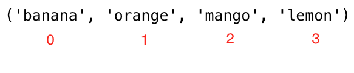

# День 5

## Списки

В Python существует четыре типа данных коллекции :

- Список: это коллекция, которая упорядочена и изменяема (модифицируема). Позволяет дублировать члены.
- Кортеж: это упорядоченная и неизменяемая или немодифицируемая (неизменяемая) коллекция. Допускает дублирование членов.
- Набор: это коллекция, которая является неупорядоченной, неиндексированной и неизменяемой, но мы можем добавлять новые элементы в набор. Дублирование членов не допускается.
- Словарь: это коллекция, которая является неупорядоченной, изменяемой (модифицируемой) и индексируемой. Нет дублирующих членов.

Список - это коллекция различных типов данных, упорядоченная и изменяемая (mutable). Список может быть пустым или содержать элементы разных типов данных.

### Как создать список

В Python мы можем создавать списки двумя способами:

- Использование встроенной функции списка

``py
# синтаксис
lst = list()
```

``py
empty_list = list() # это пустой список, в списке нет ни одного элемента
print(len(empty_list)) # 0
```

- Используя квадратные скобки, []

``py
# синтаксис
lst = []
```

``py
empty_list = [] # это пустой список, в списке нет ни одного элемента
print(len(empty_list)) # 0
```

Списки с начальными значениями. Мы используем _len()_ для определения длины списка.

``py
fruits = ['banana', 'orange', 'mango', 'lemon'] # список фруктов
овощи = ['Томат', 'Картофель', 'Капуста', 'Лук', 'Морковь'] # список овощей
animal_products = ['milk', 'meat', 'butter', 'yoghurt'] # список продуктов животного происхождения
web_techs = ['HTML', 'CSS', 'JS', 'React', 'Redux', 'Node', 'MongDB'] # список веб-технологий
страны = ['Финляндия', 'Эстония', 'Дания', 'Швеция', 'Норвегия'].

# Выведите списки и их длину
print('Фрукты:', fruits)
print('Количество фруктов:', len(fruits))
print('Овощи:', овощи)
print('Количество овощей:', len(vegetables))
print('Продукты животного происхождения:',animal_products)
print('Количество продуктов животного происхождения:', len(animal_products))
print('Веб-технологии:', web_techs)
print('Количество веб-технологий:', len(web_techs))
print('Страны:', страны)
print('Количество стран:', len(countries))
```

``sh
выход
Фрукты: ['банан', 'апельсин', 'манго', 'лимон'].
Количество фруктов: 4
Овощи: ['Томат', 'Картофель', 'Капуста', 'Лук', 'Морковь'].
Количество овощей: 5
Продукты животного происхождения: ['молоко', 'мясо', 'масло', 'йогурт'].
Количество продуктов животного происхождения: 4
Веб-технологии: ['HTML', 'CSS', 'JS', 'React', 'Redux', 'Node', 'MongDB'].
Количество веб-технологий: 7
Страны: ['Финляндия', 'Эстония', 'Дания', 'Швеция', 'Норвегия'].
Количество стран: 5
```

- Списки могут содержать элементы различных типов данных

``py
 lst = ['Asabeneh', 250, True, {'country':'Finland', 'city':'Helsinki'}] # список, содержащий различные типы данных
```

### Доступ к элементам списка с помощью позитивного индексирования

Мы обращаемся к каждому элементу списка, используя его индекс. Индекс списка начинается с 0. На рисунке ниже хорошо видно, где начинается индекс


``py
фрукты = ['банан', 'апельсин', 'манго', 'лимон'].
first_fruit = fruits[0] # мы обращаемся к первому элементу, используя его индекс
print(first_fruit) # банан
второй_фрукт = фрукты[1]
print(second_fruit) # апельсин
последний_фрукт = фрукты[3]
print(last_fruit) # лимон
# Последний индекс
last_index = len(fruits) - 1
last_fruit = fruits[last_index]
```

### Доступ к элементам списка с использованием отрицательного индексирования

Отрицательная индексация означает начало с конца, -1 относится к последнему элементу, -2 относится ко второму последнему элементу.


``py
фрукты = ['банан', 'апельсин', 'манго', 'лимон'].
первый_фрукт = фрукты[-4]
последний_фрукт = фрукты[-1]
second_last = fruits[-2]
print(first_fruit) # банан
print(last_fruit) # лимон
print(second_last) # манго
```

### Распаковка элементов списка

``py
lst = ['item','item2','item3','item4','item5']
первый_пункт, второй_пункт, третий_пункт, *rest = lst
print(first_item) # item1
print(second_item) # item2
print(third_item) # item3
print(rest) # ['item4', 'item5']

```

``py
# Первый пример
фрукты = ['банан', 'апельсин', 'манго', 'лимон', 'лайм', 'яблоко'].
первый_фрукт, второй_фрукт, третий_фрукт, *остаток = lst
print(first_fruit) # банан
print(second_fruit) # апельсин
print(third_fruit) # манго
print(rest) # ['лимон','лайм','яблоко']
# Второй пример о распаковке списка
первый, второй, третий, *остальной, десятый = [1,2,3,4,5,6,7,8,9,10]
print(first) # 1
print(second) # 2
print(third) # 3
print(rest) # [4,5,6,7,8,9]
print(tenth) # 10
# Третий пример о распаковке списка
страны = ['Германия', 'Франция', 'Бельгия', 'Швеция', 'Дания', 'Финляндия', 'Норвегия', 'Исландия', 'Эстония'].
gr, fr, bg, sw, *scandic, es = страны
print(gr)
print(fr)
print(bg)
print(sw)
print(scandic)
print(es)
```

### Нарезка элементов из списка

- Позитивное индексирование: Мы можем задать диапазон положительных индексов, указав начало, конец и шаг, возвращаемым значением будет новый список. (значения по умолчанию для start = 0, end = len(lst) - 1 (последний элемент), step = 1)

``py
фрукты = ['банан', 'апельсин', 'манго', 'лимон'].
all_fruits = fruits[0:4] # возвращает все фрукты
# это также даст тот же результат, что и в предыдущем случае
all_fruits = fruits[0:] # если мы не задали, на чем остановиться, он берет все остальное
orange_and_mango = fruits[1:3] # не включает первый индекс
апельсин_манго_лимон = фрукты[1:]
orange_and_lemon = fruits[::2] # здесь мы использовали 3-й аргумент, step. Будет взят каждый 2-й элемент - ['банан', 'манго'].
```

- Отрицательная индексация: Мы можем задать диапазон отрицательных индексов, указав начало, конец и шаг, возвращаемым значением будет новый список.

``py
фрукты = ['банан', 'апельсин', 'манго', 'лимон'].
all_fruits = fruits[-4:] # возвращает все фрукты
orange_and_mango = fruits[-3:-1] # не включает последний индекс,['orange', 'mango'].
orange_mango_lemon = fruits[-3:] # это даст начиная с -3 и до конца,['orange', 'mango', 'lemon'].
reverse_fruits = fruits[::-1] # отрицательный шаг будет вести список в обратном порядке,['lemon', 'mango', 'orange', 'banana'].
```

### Изменение списков

Список - это изменяемая или модифицируемая упорядоченная коллекция элементов. Давайте изменим список фруктов.

``py
фрукты = ['банан', 'апельсин', 'манго', 'лимон'].
fruits[0] = 'avocado'
print(fruits) # ['авокадо', 'апельсин', 'манго', 'лимон'].
fruits[1] = 'apple'
print(fruits) # ['авокадо', 'яблоко', 'манго', 'лимон'].
last_index = len(fruits) - 1
fruits[last_index] = 'lime'
print(fruits) # ['авокадо', 'яблоко', 'манго', 'лайм'].
```

### Проверка элементов в списке

Проверка элемента на принадлежность к списку с помощью оператора *in*. Смотрите пример ниже.

``py
фрукты = ['банан', 'апельсин', 'манго', 'лимон'].
does_exist = 'banana' в разделе fruits
print(does_exist) # True
does_exist = 'лайм' во фруктах
print(does_exist) # False
```

### Добавление элементов в список

Чтобы добавить элемент в конец существующего списка, мы используем метод *append()*.

``py
# синтаксис
lst = list()
lst.append(item)
```

``py
фрукты = ['банан', 'апельсин', 'манго', 'лимон'].
fruits.append('apple')
print(fruits) # ['банан', 'апельсин', 'манго', 'лимон', 'яблоко'].
fruits.append('lime') # ['banana', 'orange', 'mango', 'lemon', 'apple', 'lime']
print(fruits)
```

### Вставка элементов в список

Мы можем использовать метод *insert()* для вставки одного элемента по указанному индексу в список. Обратите внимание, что другие элементы сдвигаются вправо. Метод *insert()* принимает два аргумента: индекс и элемент для вставки.

``py
# синтаксис
lst = ['item1', 'item2']
lst.insert(index, item)
```

``py
фрукты = ['банан', 'апельсин', 'манго', 'лимон'].
fruits.insert(2, 'apple') # вставить яблоко между апельсином и манго
print(fruits) # ['банан', 'апельсин', 'яблоко', 'манго', 'лимон'].
fruits.insert(3, 'lime') # ['banana', 'orange', 'apple', 'lime', 'mango', 'lemon']
print(fruits)
```

### Удаление элементов из списка

Метод remove удаляет указанный элемент из списка

``py
# синтаксис
lst = ['item1', 'item2']
lst.remove(item)
```

``py
фрукты = ['банан', 'апельсин', 'манго', 'лимон', 'банан'].
fruits.remove('banana')
print(fruits) # ['orange', 'mango', 'lemon', 'banana'] - этот метод удаляет первое вхождение элемента в списке
fruits.remove('lemon')
print(fruits) # ['апельсин', 'манго', 'банан'].
```

### Удаление элементов с помощью Pop

Метод *pop()* удаляет указанный индекс (или последний элемент, если индекс не указан):

``py
# синтаксис
lst = ['item1', 'item2']
lst.pop() # последний элемент
lst.pop(index)
```

``py
фрукты = ['банан', 'апельсин', 'манго', 'лимон'].
fruits.pop()
print(fruits) # ['банан', 'апельсин', 'манго'].

fruits.pop(0)
print(fruits) # ['апельсин', 'манго'].
```

### Удаление элементов с помощью Del

Ключевое слово *del* удаляет указанный индекс, а также может использоваться для удаления элементов в диапазоне индексов. Оно также может полностью удалить список

``py
# синтаксис
lst = ['item1', 'item2']
del lst[index] # только один элемент
del lst # для полного удаления списка
```

``py
фрукты = ['банан', 'апельсин', 'манго', 'лимон', 'киви', 'лайм'].
del fruits[0]
print(fruits) # ['апельсин', 'манго', 'лимон', 'киви', 'лайм'].
del fruits[1]
print(fruits) # ['апельсин', 'лимон', 'киви', 'лайм'].
del fruits[1:3] # удаляет элементы между заданными индексами, поэтому не удаляет элемент с индексом 3!
print(fruits) # ['апельсин', 'лайм'].
фрукты
print(fruits) # Это должно дать: NameError: имя 'fruits' не определено
```

### Очистка элементов списка

Метод *clear()* очищает список:

``py
# синтаксис
lst = ['item1', 'item2']
lst.clear()
```

``py
фрукты = ['банан', 'апельсин', 'манго', 'лимон'].
fruits.clear()
print(fruits) # []
```

### Копирование списка

Можно скопировать список, переназначив его на новую переменную следующим образом: list2 = list1. Теперь list2 является ссылкой на list1, любые изменения, которые мы делаем в list2, также изменяют оригинал list2. Но есть много случаев, когда мы не хотим изменять оригинал, вместо этого мы хотим иметь другую копию. Один из способов избежать вышеописанной проблемы - использовать _copy()_.

``py
# синтаксис
lst = ['item1', 'item2']
lst_copy = lst.copy()
```

``py
фрукты = ['банан', 'апельсин', 'манго', 'лимон'].
fruits_copy = fruits.copy()
print(fruits_copy) # ['banana', 'orange', 'mango', 'lemon']
```

### Присоединяющиеся списки

В Python существует несколько способов объединения, или конкатенации, двух или более списков.

- Плюс оператор (+)

``py
# синтаксис
список3 = список1 + список2
```

``py
положительные_числа = [1, 2, 3, 4, 5]
ноль = [0]
отрицательные_числа = [-5,-4,-3,-2,-1]
целые числа = отрицательные_числа + ноль + положительные_числа
print(integers) # [-5, -4, -3, -2, -1, 0, 1, 2, 3, 4, 5]
фрукты = ['банан', 'апельсин', 'манго', 'лимон'].
овощи = ['Томат', 'Картофель', 'Капуста', 'Лук', 'Морковь'].
фрукты_и_овощи = фрукты + овощи
print(fruits_and_vegetables ) # ['banana', 'orange', 'mango', 'lemon', 'Tomato', 'Potato', 'Cabbage', 'Onion', 'Carrot'].
```

- Объединение с помощью метода extend()
  Метод *extend()* позволяет добавить список в список. См. пример ниже.

``py
# синтаксис
list1 = ['item1', 'item2']
list2 = ['item3', 'item4', 'item5']
list1.extend(list2)
```

``py
num1 = [0, 1, 2, 3]
num2= [4, 5, 6]
num1.extend(num2)
print('Числа:', num1) # Числа: [0, 1, 2, 3, 4, 5, 6]
отрицательные_числа = [-5,-4,-3,-2,-1]
положительные_числа = [1, 2, 3, 4, 5]
ноль = [0]

negative_numbers.extend(zero)
negative_numbers.extend(positive_numbers)
print('Целые числа:', negative_numbers) # Целые числа: [-5, -4, -3, -2, -1, 0, 1, 2, 3, 4, 5].
фрукты = ['банан', 'апельсин', 'манго', 'лимон'].
овощи = ['Томат', 'Картофель', 'Капуста', 'Лук', 'Морковь'].
fruits.extend(vegetables)
print('Фрукты и овощи:', fruits ) # Фрукты и овощи: ['банан', 'апельсин', 'манго', 'лимон', 'томат', 'картофель', 'капуста', 'лук', 'морковь'].
```

### Подсчет элементов в списке

Метод *count()* возвращает количество появлений элемента в списке:

``py
# синтаксис
lst = ['item1', 'item2']
lst.count(item)
```

``py
фрукты = ['банан', 'апельсин', 'манго', 'лимон'].
print(fruits.count('orange'))   # 1
возраст = [22, 19, 24, 25, 26, 24, 25, 24].
print(ages.count(24))           # 3
```

### Поиск индекса элемента

Метод *index()* возвращает индекс элемента в списке:

``py
# синтаксис
lst = ['item1', 'item2']
lst.index(item)
```

``py
фрукты = ['банан', 'апельсин', 'манго', 'лимон'].
print(fruits.index('orange'))   # 1
возраст = [22, 19, 24, 25, 26, 24, 25, 24].
print(ages.index(24))           # 2, первое появление
```

### Обратный список

Метод *reverse()* изменяет порядок списка на обратный.

``py
# синтаксис
lst = ['item1', 'item2']
lst.reverse()

```

``py
фрукты = ['банан', 'апельсин', 'манго', 'лимон'].
fruits.reverse()
print(fruits) # ['лимон', 'манго', 'апельсин', 'банан'].
возраст = [22, 19, 24, 25, 26, 24, 25, 24].
ages.reverse()
print(ages) # [24, 25, 24, 26, 25, 24, 19, 22]
```

### Сортировка элементов списка

Для сортировки списков мы можем использовать метод _sort()_ или встроенные функции _sorted()_. Метод _sort()_ переупорядочивает элементы списка в порядке возрастания и изменяет исходный список. Если аргумент метода _sort()_ reverse равен true, то он упорядочивает список по убыванию.

- sort(): этот метод изменяет исходный список

  ``py
  # синтаксис
  lst = ['item1', 'item2']
  lst.sort() # по возрастанию
  lst.sort(reverse=True) # по убыванию
  ```

  **Пример:**

  ``py
  фрукты = ['банан', 'апельсин', 'манго', 'лимон'].
  fruits.sort()
  print(fruits) # отсортированные в алфавитном порядке, ['банан', 'лимон', 'манго', 'апельсин'].
  fruits.sort(reverse=True)
  print(fruits) # ['апельсин', 'манго', 'лимон', 'банан'].
  возраст = [22, 19, 24, 25, 26, 24, 25, 24].
  возрасты.сортировать()
  print(ages) # [19, 22, 24, 24, 24, 24, 25, 25, 26]
 
  ages.sort(reverse=True)
  print(ages) # [26, 25, 25, 24, 24, 24, 24, 22, 19]
  ```

  sorted(): возвращает упорядоченный список без изменения исходного списка
  **Пример:**

  ``py
  фрукты = ['банан', 'апельсин', 'манго', 'лимон'].
  print(sorted(fruits))   # ['банан', 'лимон', 'манго', 'апельсин']
  # Обратный порядок
  фрукты = ['банан', 'апельсин', 'манго', 'лимон'].
  fruits = sorted(fruits,reverse=True)
  print(fruits) # ['апельсин', 'манго', 'лимон', 'банан'].
  ```

🌕 Вы усердны и уже многого достигли. Вы только что завершили 5-й день испытаний и находитесь на 5 шагов впереди на пути к величию. Теперь сделайте несколько упражнений для вашего мозга и мышц.

## 💻 Упражнения: День 5

### Упражнения: Уровень 1

1. Объявите пустой список
2. Объявите список, содержащий более 5 элементов
3. Определите длину вашего списка
4. Получите первый элемент, средний элемент и последний элемент списка
5. Объявите список mixed_data_types, поместите в него ваши(имя, возраст, рост, семейное положение, адрес)
6. Объявите переменную-список с именем it_companies и присвойте ей начальные значения Facebook, Google, Microsoft, Apple, IBM, Oracle и Amazon.
7. Выведите список с помощью _print()_.
8. Выведите количество компаний в списке
9. Напечатайте фамилию, имя, отчество и фамилию компании
10. Печать списка после изменения одной из компаний
11. Добавить ИТ-компанию в it_companies
12. Вставьте ИТ-компанию в середину списка компаний
13. Измените название одной из it_companies на заглавное (IBM исключается!).
14. Присоедините к it_companies строку '#;&nbsp; '
15. Проверьте, существует ли определенная компания в списке it_companies.
16. Отсортируйте список с помощью метода sort()
17. Переверните список в порядке убывания с помощью метода reverse()
18. Вырежьте первые 3 компании из списка
19. Вырежьте из списка последние 3 компании
20. Вырежьте из списка среднюю ИТ-компанию или компании
21. Удалите первую ИТ-компанию из списка
22. Удалите из списка среднюю ИТ-компанию или компании
23. Удалите из списка последнюю ИТ-компанию
24. Исключите из списка все ИТ-компании
25. Уничтожить список ИТ-компаний
26. Присоединяйтесь к следующим спискам:

    ``py
    front_end = ['HTML', 'CSS', 'JS', 'React', 'Redux'].
    back_end = ['Node', 'Express', 'MongoDB'].
    ```

27. После объединения списков в вопросе 26. Скопируйте объединенный список и присвойте его переменной full_stack. Затем вставьте Python и SQL после Redux.

### Упражнения: Уровень 2

1. Ниже приведен список 10 возрастов студентов:

``sh
возраст = [19, 22, 19, 24, 20, 25, 26, 24, 25, 24].
```

- Отсортируйте список и найдите минимальный и максимальный возраст
- Снова добавьте в список минимальный возраст и максимальный возраст
- Найдите медианный возраст (один средний пункт или два средних пункта, деленные на два)
- Найдите средний возраст (сумма всех предметов, деленная на их количество)
- Найдите диапазон возрастов (максимальный минус минимальный)
- Сравните значение (min - среднее) и (max - среднее), используйте метод _abs()_

1. Найдите среднюю страну (страны) в [списке стран] (https://github.com/Asabeneh/30-Days-Of-Python/tree/master/data/countries.py).
1. Разделите список стран на два равных списка, если он четный, если в первой половине не на одну страну больше.
1. ['Китай', 'Россия', 'США', 'Финляндия', 'Швеция', 'Норвегия', 'Дания']. Распакуйте первые три страны, а остальные - как скандинавские страны.

# День 6:

## Кортежи

Кортеж - это коллекция различных типов данных, которая упорядочена и неизменна (immutable). Кортежи записываются с круглыми скобками (). После создания кортежа мы не можем изменить его значения. Мы не можем использовать методы add, insert, remove в кортеже, потому что он не изменяем (mutable). В отличие от списка, кортеж имеет мало методов. Методы, связанные с кортежами:

- tuple(): для создания пустого кортежа
- count(): подсчет количества заданных элементов в кортеже
- index(): для нахождения индекса указанного элемента в кортеже
- Оператор +: для объединения двух или более кортежей и создания нового кортежа

### Создание кортежа

- Пустой кортеж: Создание пустого кортежа
  
  ``py
  # синтаксис
  empty_tuple = ()
  # или используя конструктор кортежей
  empty_tuple = tuple()
  ```

- Кортеж с начальными значениями
  
  ``py
  # синтаксис
  tpl = ('item1', 'item2', 'item3')
  ```

  ``py
  фрукты = ('банан', 'апельсин', 'манго', 'лимон')
  ```

### Длина кортежа

Для получения длины кортежа мы используем метод _len()_.

``py
# синтаксис
tpl = ('item1', 'item2', 'item3')
len(tpl)
```

### Доступ к элементам кортежа

- Позитивное индексирование
  Аналогично типу данных list мы используем положительную или отрицательную индексацию для доступа к элементам кортежа.
  

  ``py
  # Синтаксис
  tpl = ('item1', 'item2', 'item3')
  первый_элемент = tpl[0]
  second_item = tpl[1]
  ```

  ``py
  фрукты = ('банан', 'апельсин', 'манго', 'лимон')
  первый_фрукт = фрукты[0]
  второй_фрукт = фрукты[1]
  last_index =len(fruits) - 1
  last_fruit = fruits[las_index]
  ```

- Отрицательная индексация
  Отрицательная индексация означает начало с конца, -1 относится к последнему элементу, -2 - ко второму последнему, а отрицательное значение длины списка/кортежа относится к первому элементу.
  

  ``py
  # Синтаксис
  tpl = ('item1', 'item2', 'item3', 'item4')
  первый_элемент = tpl[-4]
  second_item = tpl[-3]
  ```

  ``py
  фрукты = ('банан', 'апельсин', 'манго', 'лимон')
  первый_фрукт = фрукты[-4]
  второй_фрукт = фрукты[-3]
  последний_фрукт = фрукты[-1]
  ```

### Нарезка кортежей

Мы можем вырезать подкортеж, указав диапазон индексов, с которых нужно начинать и на которых нужно заканчивать кортеж, возвращаемым значением будет новый кортеж с указанными элементами.

- Диапазон положительных индексов

  ``py
  # Синтаксис
  tpl = ('item1', 'item2', 'item3', 'item4')
  all_items = tpl[0:4] # все элементы
  all_items = tpl[0:] # все элементы
  middle_two_items = tpl[1:3] # не включает элемент с индексом 3
  ```

  ``py
  фрукты = ('банан', 'апельсин', 'манго', 'лимон')
  all_fruits = fruits[0:4] # все предметы
  all_fruits= fruits[0:] # все предметы
  orange_mango = fruits[1:3] # не включает элемент с индексом 3
  апельсин_к_остальному = фрукты[1:]
  ```

- Диапазон отрицательных индексов

  ``py
  # Синтаксис
  tpl = ('item1', 'item2', 'item3', 'item4')
  all_items = tpl[-4:] # все элементы
  middle_two_items = tpl[-3:-1] # не включает элемент с индексом 3 (-1)
  ```

  ``py
  фрукты = ('банан', 'апельсин', 'манго', 'лимон')
  all_fruits = fruits[-4:] # все предметы
  orange_mango = fruits[-3:-1] # не включает элемент с индексом 3
  апельсин_к_остальному = фрукты[-3:]
  ```

### Замена кортежей на списки

Мы можем менять кортежи на списки и списки на кортежи. Кортеж неизменяем, если мы хотим изменить кортеж, мы должны изменить его на список.

``py
# Синтаксис
tpl = ('item1', 'item2', 'item3', 'item4')
lst = list(tpl)
```

``py
фрукты = ('банан', 'апельсин', 'манго', 'лимон')
фрукты = список(фрукты)
fruits[0] = 'apple'
print(fruits) # ['яблоко', 'апельсин', 'манго', 'лимон'].
фрукты = кортеж(фрукты)
print(fruits) # ('яблоко', 'апельсин', 'манго', 'лимон')
```

### Проверка элемента в связке

Мы можем проверить, существует или нет элемент в кортеже, используя _in_, он возвращает булеву величину.

``py
# Синтаксис
tpl = ('item1', 'item2', 'item3', 'item4')
'item2' в tpl # True
```

``py
фрукты = ('банан', 'апельсин', 'манго', 'лимон')
print('orange' в fruits) # True
print('apple' в fruits) # False
fruits[0] = 'apple' # TypeError: объект 'tuple' не поддерживает присвоение элементов
```

### Объединение кортежей

Мы можем объединить два или более кортежей с помощью оператора +

``py
# синтаксис
tpl1 = ('item1', 'item2', 'item3')
tpl2 = ('item4', 'item5', 'item6')
tpl3 = tpl1 + tpl2
```

``py
фрукты = ('банан', 'апельсин', 'манго', 'лимон')
овощи = ('Томат', 'Картофель', 'Капуста', 'Лук', 'Морковь')
фрукты_и_овощи = фрукты + овощи
```

### Удаление кортежей

Невозможно удалить отдельный элемент в кортеже, но можно удалить сам кортеж, используя _del_.

``py
# синтаксис
tpl1 = ('item1', 'item2', 'item3')
del tpl1

```

``py
фрукты = ('банан', 'апельсин', 'манго', 'лимон')
фрукты
```

🌕 Вы такой смелый, что смогли зайти так далеко. Вы только что завершили 6-й день испытаний, и вы уже на 6 шагов впереди на пути к величию. Теперь сделайте несколько упражнений для вашего мозга и для ваших мышц.

## 💻 Упражнения: День 6

### Упражнения: Уровень 1

1. Создайте пустой кортеж
2. Создайте кортеж, содержащий имена ваших сестер и братьев (воображаемые братья и сестры вполне подойдут)
3. Объединить кортежи братьев и сестер и присвоить их братьям и сестрам
4. Сколько у вас братьев и сестер?
5. Измените кортеж siblings, добавьте имена отца и матери и присвойте его family_members

### Упражнения: Уровень 2

1. Распакуйте братьев и сестер и родителей из family_members
1. Создайте кортежи фруктов, овощей и продуктов животного происхождения. Объедините три кортежа и присвойте их переменной food_stuff_tp.
1. Измените кортеж about food_stuff_tp на список food_stuff_lt
1. Вырежьте средний элемент или элементы из кортежа food_stuff_tp или списка food_stuff_lt.
1. Вырежьте первые три элемента и последние три элемента из списка food_staff_lt
1. Полностью удалите кортеж food_staff_tp
1. Проверьте, существует ли элемент в кортеже:

- Проверьте, является ли 'Эстония' северной страной
- Проверьте, является ли 'Исландия' северной страной

  ``py
  nordic_countries = ('Дания', 'Финляндия', 'Исландия', 'Норвегия', 'Швеция')
  ```
